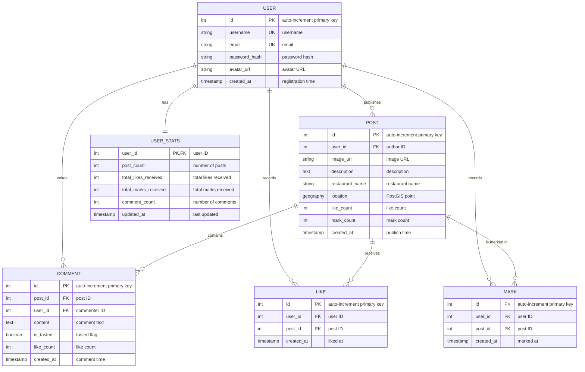

# Foodie Share Database Architecture Design Report

## 1. Project Overview

**Foodie Share** is a social sharing platform for food lovers. Users can post food photos, share dining experiences, save restaurants they are interested in, and discover nearby food hotspots based on location.

This project was developed as a major assignment for a database management course. Its main objective is to demonstrate solid relational database design skills, including ER modeling, normalization, stored routines, triggers, and advanced SQL features.

**Technology stack:**
- Frontend: React 19 + Vite
- Backend: Node.js + Express
- Database: PostgreSQL 16 + PostGIS extension
- Deployment: Docker Compose + Nginx reverse proxy

---

## 2. Requirements Analysis

### 2.1 Functional Requirements

| Functional Module | Description |
|------------------|-------------|
| User system | Registration, login (JWT cookie), avatar management |
| Post management | Publish food posts with images, descriptions, restaurant names, and locations |
| Interaction system | Like posts, save posts as marks, and comment on posts |
| Comment system | Add comments, increment comment likes, and mark comments as "tasted" |
| Geo discovery | Search marked food posts within a 3 km radius of the current location |
| Analytics | Top post ranking, active user ranking, and geographic clustering |
| Query gateway | Unified backend gateway for database query routines |

### 2.2 Data Requirements

- User profile data: username, email, password hash, avatar, registration time
- Post data: image, description, restaurant name, geographic coordinates, like count, mark count
- Interaction data: which user liked which post, and which user marked which post
- Comment data: comment content, tasted flag, like count
- Aggregated statistics: post count, likes received, marks received, comment count

---

## 3. ER Model Design

### 3.1 Entity Definitions

| Entity | Description |
|--------|-------------|
| **User** | A registered platform user |
| **Post** | A food-sharing post published by a user |
| **Comment** | A user comment on a post |
| **Like** | A record of a user liking a post |
| **Mark** | A record of a user saving a post |
| **CommentLike** | ~~Removed and simplified into a counter field~~ |
| **UserStats** | Aggregated per-user statistics |

### 3.2 Relationship Definitions

| Relationship | Participating Entities | Cardinality | Description |
|-------------|------------------------|-------------|-------------|
| Publishes | User -> Post | 1:N | One user can publish many posts |
| Comments on | User -> Comment, Post -> Comment | 1:N | One user and one post can each be associated with many comments |
| Likes | User <-> Post | M:N | Implemented through the `likes` junction table |
| Marks | User <-> Post | M:N | Implemented through the `marks` junction table |
| ~~Comment likes~~ | ~~User <-> Comment~~ | ~~M:N~~ | ~~Simplified into a counter, so no junction table is needed~~ |

### 3.3 ER Diagram



---

## 4. Relational Schema Design

All tables satisfy **Third Normal Form (3NF)**:
- Each attribute is atomic (1NF)
- There are no partial dependencies of non-key attributes on candidate keys (2NF)
- There are no transitive dependencies of non-key attributes on candidate keys (3NF)

### 4.1 Table Details

#### `users`
```sql
CREATE TABLE users (
    id SERIAL PRIMARY KEY,
    username VARCHAR(50) UNIQUE NOT NULL,
    email VARCHAR(255) UNIQUE NOT NULL,
    password_hash VARCHAR(255) NOT NULL,
    avatar_url TEXT DEFAULT '/default-avatar.png',
    created_at TIMESTAMP DEFAULT NOW()
);
```

#### `posts`
```sql
CREATE TABLE posts (
    id SERIAL PRIMARY KEY,
    user_id INTEGER REFERENCES users(id) ON DELETE CASCADE NOT NULL,
    image_url TEXT NOT NULL DEFAULT '/default-food.png',
    description TEXT,
    restaurant_name VARCHAR(255),
    location GEOGRAPHY(POINT, 4326),
    like_count INTEGER DEFAULT 0,
    mark_count INTEGER DEFAULT 0,
    created_at TIMESTAMP DEFAULT NOW()
);
```

#### `likes`
```sql
CREATE TABLE likes (
    id SERIAL PRIMARY KEY,
    user_id INTEGER REFERENCES users(id) ON DELETE CASCADE NOT NULL,
    post_id INTEGER REFERENCES posts(id) ON DELETE CASCADE NOT NULL,
    created_at TIMESTAMP DEFAULT NOW(),
    UNIQUE(user_id, post_id)
);
```

#### `marks`
```sql
CREATE TABLE marks (
    id SERIAL PRIMARY KEY,
    user_id INTEGER REFERENCES users(id) ON DELETE CASCADE NOT NULL,
    post_id INTEGER REFERENCES posts(id) ON DELETE CASCADE NOT NULL,
    created_at TIMESTAMP DEFAULT NOW(),
    UNIQUE(user_id, post_id)
);
```

#### `comments`
```sql
CREATE TABLE comments (
    id SERIAL PRIMARY KEY,
    post_id INTEGER REFERENCES posts(id) ON DELETE CASCADE NOT NULL,
    user_id INTEGER REFERENCES users(id) ON DELETE CASCADE NOT NULL,
    content TEXT NOT NULL,
    is_tasted BOOLEAN DEFAULT FALSE,
    like_count INTEGER DEFAULT 0,
    created_at TIMESTAMP DEFAULT NOW()
);
```

#### ~~`comment_likes` (removed)~~
~~The original design included a junction table for per-user comment likes. The current implementation simplifies this into the `comments.like_count` counter and no longer stores who liked a comment.~~

#### `user_stats`
```sql
CREATE TABLE user_stats (
    user_id INTEGER PRIMARY KEY REFERENCES users(id) ON DELETE CASCADE,
    post_count INTEGER DEFAULT 0,
    total_likes_received INTEGER DEFAULT 0,
    total_marks_received INTEGER DEFAULT 0,
    comment_count INTEGER DEFAULT 0,
    updated_at TIMESTAMP DEFAULT NOW()
);
```

### 4.2 Materialized View

#### `mv_top_posts`
```sql
CREATE MATERIALIZED VIEW mv_top_posts AS
SELECT
    p.id, p.user_id, u.username, u.avatar_url,
    p.image_url, p.description, p.restaurant_name,
    p.like_count, p.mark_count, p.created_at
FROM posts p
JOIN users u ON p.user_id = u.id
ORDER BY p.like_count DESC, p.created_at DESC;
```

---

## 5. Stored Routine Design

Write operations are encapsulated as stored procedures, while read-heavy operations are exposed as SQL functions. This keeps complex database logic inside PostgreSQL and avoids embedding raw business SQL in the application layer.

| No. | Routine Name | Type | Purpose |
|-----|--------------|------|---------|
| 1 | `like_post(user_id, post_id)` | Procedure | Like a post with duplicate protection |
| 2 | `unlike_post(user_id, post_id)` | Procedure | Remove a post like |
| 3 | `mark_post(user_id, post_id)` | Procedure | Save a post with duplicate protection |
| 4 | `unmark_post(user_id, post_id)` | Procedure | Remove a saved post |
| 5 | `add_comment(user_id, post_id, content, is_tasted)` | Procedure | Add a comment |
| 6 | `increment_comment_likes(comment_id)` | Procedure | Increment the comment like counter |
| 7 | `get_user_feed(user_id, sort_by, limit, offset)` | Function | Retrieve the personalized feed |
| 8 | `get_nearby_marks(user_id, lat, lng, radius)` | Function | Search nearby marked posts with PostGIS |
| 9 | `get_post_comments(post_id)` | Function | Retrieve comments for a post |
| 10 | `get_user_profile_stats(user_id)` | Function | Retrieve user profile statistics |
| 11 | `get_top_posts(limit)` | Function | Retrieve the top-post leaderboard |
| 12 | `get_top_users(limit)` | Function | Retrieve the active-user leaderboard |
| 13 | `get_geo_clusters(min_points, eps)` | Function | Perform DBSCAN-based geographic clustering |

> **Note:** An earlier version of the design considered per-user comment-like records. The current implementation replaces that feature with a simple counter, which removes one junction table and two extra comment-like procedures.

### 5.1 Core Routine Examples

**Feed query with per-user interaction state:**
```sql
CREATE OR REPLACE FUNCTION get_user_feed(
    p_user_id INT,
    p_sort_by VARCHAR DEFAULT 'likes',
    p_limit INT DEFAULT 20,
    p_offset INT DEFAULT 0
)
RETURNS TABLE (...)
AS $$
BEGIN
    RETURN QUERY
    SELECT
        p.id,
        p.user_id,
        u.username,
        u.avatar_url,
        p.image_url,
        p.description,
        p.restaurant_name,
        p.like_count,
        p.mark_count,
        EXISTS(
            SELECT 1
            FROM likes l
            WHERE l.post_id = p.id AND l.user_id = p_user_id
        ) AS user_has_liked,
        EXISTS(
            SELECT 1
            FROM marks m
            WHERE m.post_id = p.id AND m.user_id = p_user_id
        ) AS user_has_marked,
        p.created_at
    FROM posts p
    JOIN users u ON p.user_id = u.id
    ORDER BY ...
    LIMIT p_limit OFFSET p_offset;
END;
$$;
```

**Nearby search with a 3 km radius using PostGIS:**
```sql
CREATE OR REPLACE FUNCTION get_nearby_marks(
    p_user_id INT,
    p_lat DOUBLE PRECISION,
    p_lng DOUBLE PRECISION,
    p_radius_meters INT DEFAULT 3000
)
RETURNS TABLE (...)
AS $$
BEGIN
    RETURN QUERY
    SELECT
        p.id,
        p.user_id,
        u.username,
        u.avatar_url,
        p.image_url,
        p.description,
        p.restaurant_name,
        p.like_count,
        p.mark_count,
        ST_Distance(
            p.location::geography,
            ST_SetSRID(ST_MakePoint(p_lng, p_lat), 4326)::geography
        ) AS distance_meters,
        p.created_at
    FROM posts p
    JOIN marks m ON p.id = m.post_id AND m.user_id = p_user_id
    JOIN users u ON p.user_id = u.id
    WHERE ST_DWithin(
        p.location::geography,
        ST_SetSRID(ST_MakePoint(p_lng, p_lat), 4326)::geography,
        p_radius_meters
    )
    ORDER BY p.like_count DESC, distance_meters ASC;
END;
$$;
```

---

## 6. Trigger Design

Triggers are used to maintain denormalized counters and aggregated statistics, ensuring consistency without pushing the burden onto the application layer.

| No. | Trigger Name | Target Table | Timing | Purpose |
|-----|--------------|--------------|--------|---------|
| 1 | `trg_post_like_count` | `likes` | AFTER INSERT/DELETE | Automatically update `posts.like_count` |
| 2 | `trg_post_mark_count` | `marks` | AFTER INSERT/DELETE | Automatically update `posts.mark_count` |
| 3 | `trg_user_stats` | `posts` | AFTER INSERT/DELETE/UPDATE | Automatically maintain `user_stats` |
| 4 | `trg_user_comment_count` | `comments` | AFTER INSERT/DELETE | Automatically maintain `user_stats.comment_count` |
| 5 | `trg_refresh_mv_top_posts` | `posts` | AFTER INSERT/DELETE/UPDATE | Refresh the `mv_top_posts` materialized view |

The previous `comment_likes` trigger was removed together with the per-user comment-like table. Comment likes are now handled by a direct update procedure on `comments.like_count`.

### 6.1 Trigger Examples

**Automatic maintenance of post like counts:**
```sql
CREATE OR REPLACE FUNCTION trg_fn_update_post_like_count()
RETURNS TRIGGER
LANGUAGE plpgsql
AS $$
BEGIN
    IF TG_OP = 'INSERT' THEN
        UPDATE posts SET like_count = like_count + 1 WHERE id = NEW.post_id;
        RETURN NEW;
    ELSIF TG_OP = 'DELETE' THEN
        UPDATE posts SET like_count = GREATEST(like_count - 1, 0) WHERE id = OLD.post_id;
        RETURN OLD;
    END IF;
    RETURN NULL;
END;
$$;

CREATE TRIGGER trg_post_like_count
AFTER INSERT OR DELETE ON likes
FOR EACH ROW
EXECUTE FUNCTION trg_fn_update_post_like_count();
```

**Automatic maintenance of user statistics, including cascaded effects when a post is removed:**
```sql
CREATE OR REPLACE FUNCTION trg_fn_update_user_stats()
RETURNS TRIGGER
LANGUAGE plpgsql
AS $$
BEGIN
    IF TG_OP = 'INSERT' THEN
        INSERT INTO user_stats (user_id, post_count, total_likes_received, total_marks_received)
        VALUES (NEW.user_id, 1, 0, 0)
        ON CONFLICT (user_id) DO UPDATE SET
            post_count = user_stats.post_count + 1,
            updated_at = NOW();
    ELSIF TG_OP = 'DELETE' THEN
        UPDATE user_stats SET
            post_count = GREATEST(user_stats.post_count - 1, 0),
            total_likes_received = GREATEST(user_stats.total_likes_received - OLD.like_count, 0),
            total_marks_received = GREATEST(user_stats.total_marks_received - OLD.mark_count, 0),
            updated_at = NOW()
        WHERE user_id = OLD.user_id;
    ELSIF TG_OP = 'UPDATE' THEN
        UPDATE user_stats SET
            total_likes_received = user_stats.total_likes_received - OLD.like_count + NEW.like_count,
            total_marks_received = user_stats.total_marks_received - OLD.mark_count + NEW.mark_count,
            updated_at = NOW()
        WHERE user_id = NEW.user_id;
    END IF;
    RETURN NULL;
END;
$$;
```

---

## 7. Indexing and Performance Optimization

### 7.1 B-Tree Indexes

```sql
CREATE INDEX idx_posts_user_id ON posts(user_id);
CREATE INDEX idx_posts_created_at ON posts(created_at DESC);
CREATE INDEX idx_posts_like_count ON posts(like_count DESC);
CREATE INDEX idx_likes_post_id ON likes(post_id);
CREATE INDEX idx_likes_user_id ON likes(user_id);
CREATE INDEX idx_marks_user_id ON marks(user_id);
CREATE INDEX idx_marks_post_id ON marks(post_id);
CREATE INDEX idx_comments_post_id ON comments(post_id);
CREATE INDEX idx_comments_user_id ON comments(user_id);
```

### 7.2 Spatial Index (PostGIS GiST)

```sql
CREATE INDEX idx_posts_location ON posts USING GIST(location);
```

### 7.3 Materialized View Index

```sql
CREATE UNIQUE INDEX idx_mv_top_posts_id ON mv_top_posts(id);
```

---

## 8. Advanced SQL Features

### 8.1 Geospatial Queries with PostGIS

`ST_DWithin` is used for efficient radius searches by taking advantage of the GiST spatial index instead of relying on manual spherical distance formulas:

```sql
WHERE ST_DWithin(
    p.location::geography,
    ST_SetSRID(ST_MakePoint($lng, $lat), 4326)::geography,
    3000  -- 3 km radius
)
```

### 8.2 Geographic Clustering with DBSCAN

`ST_ClusterDBSCAN` is used to detect dense food hotspots:

```sql
SELECT
    cid::INT AS cluster_id,
    AVG(lat)::DOUBLE PRECISION AS center_lat,
    AVG(lng)::DOUBLE PRECISION AS center_lng,
    COUNT(*)::BIGINT AS point_count,
    AVG(like_count)::NUMERIC AS avg_likes
FROM (
    SELECT
        like_count,
        ST_Y(location::geometry) AS lat,
        ST_X(location::geometry) AS lng,
        ST_ClusterDBSCAN(location::geometry, 500, 3) OVER () AS cid
    FROM posts
    WHERE location IS NOT NULL
) c
WHERE cid IS NOT NULL
GROUP BY cid;
```

### 8.3 Query Gateway

The backend implements a lightweight action-to-routine gateway so the frontend can call a single API endpoint instead of embedding database-specific logic:

```javascript
// Frontend request
POST /api/query
{ action: "nearby", params: { lat: 22.3, lng: 114.1, radius: 3000 } }

// Backend gateway mapping
const actionMap = {
  feed: { proc: 'get_user_feed', params: ['userId', 'sort', 'limit', 'offset'] },
  nearby: { proc: 'get_nearby_marks', params: ['userId', 'lat', 'lng', 'radius'] },
  profile: { proc: 'get_user_profile_stats', params: ['userId'] },
  clusters: { proc: 'get_geo_clusters', params: ['min_points', 'eps'] },
};
```

**Design benefits:**
- No raw business SQL in the application layer
- Complex query logic is centralized inside PostgreSQL
- The interface is easier to validate and safer to expose
- The backend can use `CALL` for procedures and `SELECT * FROM function(...)` for query functions

---

## 9. Data Consistency Guarantees

### 9.1 Concurrency Safety

Like and mark operations rely on database-side triggers to update counters atomically, which avoids race conditions:
- If two users like the same post at the same time, each insert triggers its own `+1`, and the final count remains correct
- When a like is removed, the trigger applies `-1` and clamps the value at zero with `GREATEST`

### 9.2 Cascading Deletes

All foreign keys use `ON DELETE CASCADE`:
- Deleting a user automatically removes that user's posts, comments, likes, and marks
- Deleting a post automatically removes its comments, likes, and marks
- Deleting a comment removes the row itself, while `user_stats.comment_count` is updated by trigger logic

### 9.3 Denormalization Strategy

The design intentionally stores several derived counters:
- `posts.like_count` and `posts.mark_count` are maintained by triggers
- `comments.like_count` is maintained by the `increment_comment_likes` procedure
- `user_stats` stores aggregate values for profile and leaderboard queries

Compared with running live `COUNT(*)` queries on every request, this approach provides faster reads while keeping write overhead manageable.

---

## 10. Conclusion

This database design follows these principles:

1. **Normalized schema**: All core tables satisfy 3NF and minimize redundancy.
2. **Explicit many-to-many modeling**: Likes and marks are represented with clear junction tables.
3. **Encapsulated database logic**: 13 stored routines cover write operations and complex read queries.
4. **Trigger-based automation**: 5 triggers maintain denormalized counters, aggregate statistics, and the materialized view.
5. **Spatial database support**: PostGIS enables 3 km radius search and DBSCAN clustering.
6. **Performance-oriented indexing**: B-Tree and GiST indexes support common access patterns efficiently.
7. **Unified query gateway**: The backend exposes a consistent interface to database routines.

Overall, the design satisfies the course requirements for core relational database concepts while also providing a practical foundation for deployment and future extension.
