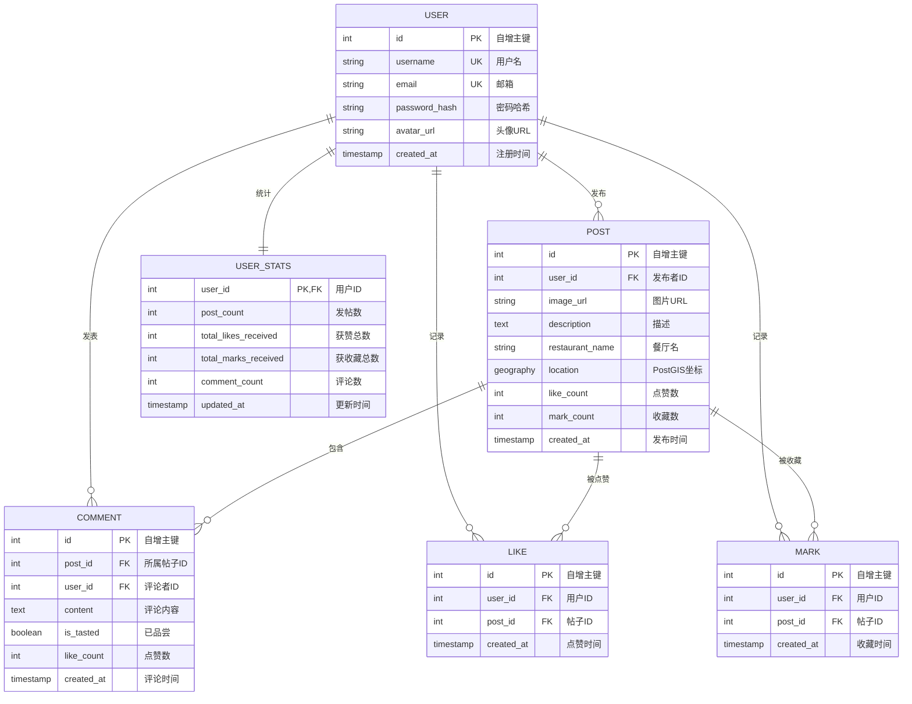

# Foodie Share 数据库架构设计报告

## 1. 项目概述

**Foodie Share（吃饭分享社群）** 是一个面向美食爱好者的社交分享平台。用户可以在平台上发布美食照片、分享用餐体验、标记感兴趣的餐厅，并基于地理位置发现附近的美食热点。

本项目作为数据库管理课程的大作业，核心目标是展示扎实的关系型数据库设计能力，包括 ER 建模、规范化设计、存储过程、触发器以及高级 SQL 特性的应用。

**技术栈：**
- 前端：React 19 + Vite
- 后端：Node.js + Express
- 数据库：PostgreSQL 16 + PostGIS 扩展
- 部署：Docker Compose + Nginx 反向代理

---

## 2. 需求分析

### 2.1 功能需求

| 功能模块 | 具体功能 |
|---------|---------|
| 用户系统 | 注册、登录（JWT Cookie）、头像管理 |
| 帖子管理 | 发布美食帖子（图片、描述、餐厅名、地理位置） |
| 互动系统 | 点赞帖子、收藏帖子（Mark）、评论帖子 |
| 评论系统 | 发表评论、评论点赞、「已品尝」标记 |
| 地理发现 | 基于当前位置搜索 3km 内收藏的美食 |
| 数据分析 | 热门帖子排行、活跃用户排行、地理位置聚类 |
| 查询网关 | 统一封装的数据库查询接口（Text-to-SQL） |

### 2.2 数据需求

- 用户基本信息：用户名、邮箱、密码哈希、头像、注册时间
- 帖子信息：图片、描述、餐厅名、地理坐标、点赞数、收藏数
- 互动记录：谁点赞了哪条帖子、谁收藏了哪条帖子
- 评论信息：评论内容、是否已品尝、点赞数
- 统计数据：用户发帖数、获赞数、获收藏数、评论数

---

## 3. ER 模型设计

### 3.1 实体定义

| 实体 | 说明 |
|-----|------|
| **用户 (User)** | 平台注册用户 |
| **帖子 (Post)** | 用户发布的美食分享内容 |
| **评论 (Comment)** | 用户对帖子的评论 |
| **点赞 (Like)** | 用户对帖子的点赞记录 |
| **收藏 (Mark)** | 用户对帖子的收藏记录 |
| **评论点赞 (CommentLike)** | ~~已移除，简化为计数器~~ |
| **用户统计 (UserStats)** | 用户的聚合统计数据 |

### 3.2 关系定义

| 关系 | 参与实体 | 基数 | 说明 |
|-----|---------|------|------|
| 发布 | User → Post | 1:N | 一个用户可以发布多条帖子 |
| 评论 | User → Comment, Post → Comment | 1:N | 一个用户/帖子可以有多个评论 |
| 点赞 | User ↔ Post | M:N | 通过 likes 关联表实现 |
| 收藏 | User ↔ Post | M:N | 通过 marks 关联表实现 |
| ~~评论点赞~~ | ~~User ↔ Comment~~ | ~~M:N~~ | ~~已简化为纯计数，无需关联表~~ |

### 3.3 ER 图



---

## 4. 关系模式设计

所有表均满足 **第三范式（3NF）**：
- 每个属性都是原子的（1NF）
- 不存在非主属性对候选键的部分依赖（2NF）
- 不存在非主属性对候选键的传递依赖（3NF）

### 4.1 表结构详情

#### users（用户表）
```sql
CREATE TABLE users (
    id SERIAL PRIMARY KEY,
    username VARCHAR(50) UNIQUE NOT NULL,
    email VARCHAR(255) UNIQUE NOT NULL,
    password_hash VARCHAR(255) NOT NULL,
    avatar_url TEXT DEFAULT '/default-avatar.png',
    created_at TIMESTAMP DEFAULT NOW()
);
```

#### posts（帖子表）
```sql
CREATE TABLE posts (
    id SERIAL PRIMARY KEY,
    user_id INTEGER REFERENCES users(id) ON DELETE CASCADE NOT NULL,
    image_url TEXT NOT NULL DEFAULT '/default-food.png',
    description TEXT,
    restaurant_name VARCHAR(255),
    location GEOGRAPHY(POINT, 4326),
    like_count INTEGER DEFAULT 0,
    mark_count INTEGER DEFAULT 0,
    created_at TIMESTAMP DEFAULT NOW()
);
```

#### likes（点赞关联表）
```sql
CREATE TABLE likes (
    id SERIAL PRIMARY KEY,
    user_id INTEGER REFERENCES users(id) ON DELETE CASCADE NOT NULL,
    post_id INTEGER REFERENCES posts(id) ON DELETE CASCADE NOT NULL,
    created_at TIMESTAMP DEFAULT NOW(),
    UNIQUE(user_id, post_id)
);
```

#### marks（收藏关联表）
```sql
CREATE TABLE marks (
    id SERIAL PRIMARY KEY,
    user_id INTEGER REFERENCES users(id) ON DELETE CASCADE NOT NULL,
    post_id INTEGER REFERENCES posts(id) ON DELETE CASCADE NOT NULL,
    created_at TIMESTAMP DEFAULT NOW(),
    UNIQUE(user_id, post_id)
);
```

#### comments（评论表）
```sql
CREATE TABLE comments (
    id SERIAL PRIMARY KEY,
    post_id INTEGER REFERENCES posts(id) ON DELETE CASCADE NOT NULL,
    user_id INTEGER REFERENCES users(id) ON DELETE CASCADE NOT NULL,
    content TEXT NOT NULL,
    is_tasted BOOLEAN DEFAULT FALSE,
    like_count INTEGER DEFAULT 0,
    created_at TIMESTAMP DEFAULT NOW()
);
```

#### ~~comment_likes（已移除）~~
~~原为评论点赞关联表，现简化为 comments.like_count 纯计数器，无需单独记录谁点了赞。~~

#### user_stats（用户统计表）
```sql
CREATE TABLE user_stats (
    user_id INTEGER PRIMARY KEY REFERENCES users(id) ON DELETE CASCADE,
    post_count INTEGER DEFAULT 0,
    total_likes_received INTEGER DEFAULT 0,
    total_marks_received INTEGER DEFAULT 0,
    comment_count INTEGER DEFAULT 0,
    updated_at TIMESTAMP DEFAULT NOW()
);
```

### 4.2 物化视图

#### mv_top_posts（热门帖子排行榜）
```sql
CREATE MATERIALIZED VIEW mv_top_posts AS
SELECT
    p.id, p.user_id, u.username, u.avatar_url,
    p.image_url, p.description, p.restaurant_name,
    p.like_count, p.mark_count, p.created_at
FROM posts p
JOIN users u ON p.user_id = u.id
ORDER BY p.like_count DESC, p.created_at DESC;
```

---

## 5. 存储过程设计

所有业务写操作均通过存储过程封装，确保业务层零裸 SQL。

| 编号 | 存储过程名 | 功能说明 |
|-----|-----------|---------|
| 1 | `like_post(user_id, post_id)` | 点赞帖子（含防重复） |
| 2 | `unlike_post(user_id, post_id)` | 取消点赞 |
| 3 | `mark_post(user_id, post_id)` | 收藏帖子（含防重复） |
| 4 | `unmark_post(user_id, post_id)` | 取消收藏 |
| 5 | `add_comment(user_id, post_id, content, is_tasted)` | 发表评论 |
| 6 | `increment_comment_likes(comment_id)` | 评论点赞计数 +1 |
| 7 | ~~`like_comment(user_id, comment_id)`~~ | ~~已移除~~ |
| 8 | ~~`unlike_comment(user_id, comment_id)`~~ | ~~已移除~~ |
| 9 | `get_user_feed(user_id, sort_by, limit, offset)` | 获取个性化 Feed |
| 9 | `get_nearby_marks(user_id, lat, lng, radius)` | PostGIS 附近搜索 |
| 10 | `get_post_comments(post_id)` | 获取帖子评论 |
| 11 | `get_user_profile_stats(user_id)` | 获取用户统计数据 |
| 12 | `get_top_posts(limit)` | 热门帖子排行 |
| 13 | `get_top_users(limit)` | 活跃用户排行 |
| 14 | `get_geo_clusters(min_points, eps)` | PostGIS DBSCAN 地理聚类 |

> **注：** 原设计有 14 个存储过程（含 comment 点赞的一对一记录），现简化为 13 个。评论点赞从「记录谁点了赞」改为「纯计数器」，减少一张关联表和两个存储过程。 |

### 5.1 核心存储过程示例

**Feed 查询（含用户互动状态）：**
```sql
CREATE OR REPLACE FUNCTION get_user_feed(
    p_user_id INT, p_sort_by VARCHAR DEFAULT 'likes',
    p_limit INT DEFAULT 20, p_offset INT DEFAULT 0
)
RETURNS TABLE (...)
AS $$
BEGIN
    RETURN QUERY
    SELECT p.*, u.username, u.avatar_url,
        EXISTS(SELECT 1 FROM likes l 
               WHERE l.post_id = p.id AND l.user_id = p_user_id) AS user_has_liked,
        EXISTS(SELECT 1 FROM marks m 
               WHERE m.post_id = p.id AND m.user_id = p_user_id) AS user_has_marked
    FROM posts p JOIN users u ON p.user_id = u.id
    ORDER BY ...
    LIMIT p_limit OFFSET p_offset;
END;
$$;
```

**PostGIS 附近搜索（3km 半径）：**
```sql
CREATE OR REPLACE FUNCTION get_nearby_marks(
    p_user_id INT, p_lat DOUBLE PRECISION,
    p_lng DOUBLE PRECISION, p_radius_meters INT DEFAULT 3000
)
RETURNS TABLE (...)
AS $$
BEGIN
    RETURN QUERY
    SELECT p.*, u.username, u.avatar_url,
        ST_Distance(p.location::geography,
            ST_SetSRID(ST_MakePoint(p_lng, p_lat), 4326)::geography
        ) AS distance_meters
    FROM posts p
    JOIN marks m ON p.id = m.post_id AND m.user_id = p_user_id
    JOIN users u ON p.user_id = u.id
    WHERE ST_DWithin(p.location::geography,
        ST_SetSRID(ST_MakePoint(p_lng, p_lat), 4326)::geography,
        p_radius_meters)
    ORDER BY p.like_count DESC, distance_meters ASC;
END;
$$;
```

---

## 6. 触发器设计

触发器用于维护反规范化字段，保证数据一致性。

| 编号 | 触发器名 | 作用表 | 触发时机 | 功能 |
|-----|---------|--------|---------|------|
| 1 | `trg_post_like_count` | likes | AFTER INSERT/DELETE | 自动更新 posts.like_count |
| 2 | `trg_post_mark_count` | marks | AFTER INSERT/DELETE | 自动更新 posts.mark_count |
| ~~3~~ | ~~`trg_comment_like_count`~~ | ~~comment_likes~~ | ~~AFTER INSERT/DELETE~~ | ~~已移除，改为直接 UPDATE~~ |
| 3 | `trg_user_stats` | posts | AFTER INSERT/DELETE/UPDATE | 自动更新 user_stats 表 |
| 4 | `trg_user_comment_count` | comments | AFTER INSERT/DELETE | 自动更新 user_stats.comment_count |
| 5 | `trg_refresh_mv_top_posts` | posts | AFTER INSERT/DELETE/UPDATE | 刷新物化视图 mv_top_posts |

### 6.1 触发器示例

**帖子点赞数自动维护：**
```sql
CREATE OR REPLACE FUNCTION trg_fn_update_post_like_count()
RETURNS TRIGGER AS $$
BEGIN
    IF TG_OP = 'INSERT' THEN
        UPDATE posts SET like_count = like_count + 1 WHERE id = NEW.post_id;
        RETURN NEW;
    ELSIF TG_OP = 'DELETE' THEN
        UPDATE posts SET like_count = GREATEST(like_count - 1, 0) WHERE id = OLD.post_id;
        RETURN OLD;
    END IF;
    RETURN NULL;
END;
$$ LANGUAGE plpgsql;

CREATE TRIGGER trg_post_like_count
AFTER INSERT OR DELETE ON likes
FOR EACH ROW EXECUTE FUNCTION trg_fn_update_post_like_count();
```

**用户统计自动维护（处理帖子删除时的级联影响）：**
```sql
CREATE OR REPLACE FUNCTION trg_fn_update_user_stats()
RETURNS TRIGGER AS $$
BEGIN
    IF TG_OP = 'DELETE' THEN
        UPDATE user_stats SET
            post_count = GREATEST(post_count - 1, 0),
            total_likes_received = GREATEST(total_likes_received - OLD.like_count, 0),
            total_marks_received = GREATEST(total_marks_received - OLD.mark_count, 0)
        WHERE user_id = OLD.user_id;
    ELSIF TG_OP = 'UPDATE' THEN
        UPDATE user_stats SET
            total_likes_received = total_likes_received - OLD.like_count + NEW.like_count,
            total_marks_received = total_marks_received - OLD.mark_count + NEW.mark_count
        WHERE user_id = NEW.user_id;
    END IF;
    RETURN NULL;
END;
$$ LANGUAGE plpgsql;
```

---

## 7. 索引与性能优化

### 7.1 B-Tree 索引

```sql
CREATE INDEX idx_posts_user_id ON posts(user_id);
CREATE INDEX idx_posts_created_at ON posts(created_at DESC);
CREATE INDEX idx_posts_like_count ON posts(like_count DESC);
CREATE INDEX idx_likes_post_id ON likes(post_id);
CREATE INDEX idx_likes_user_id ON likes(user_id);
CREATE INDEX idx_marks_user_id ON marks(user_id);
CREATE INDEX idx_marks_post_id ON marks(post_id);
CREATE INDEX idx_comments_post_id ON comments(post_id);
CREATE INDEX idx_comments_user_id ON comments(user_id);
```

### 7.2 空间索引（PostGIS GIST）

```sql
CREATE INDEX idx_posts_location ON posts USING GIST(location);
```

### 7.3 物化视图索引

```sql
CREATE UNIQUE INDEX idx_mv_top_posts_id ON mv_top_posts(id);
```

---

## 8. 高级 SQL 特性

### 8.1 地理空间计算（PostGIS）

使用 `ST_DWithin` 进行高效的空间距离查询（利用 GIST 索引），替代传统的球面三角函数计算：

```sql
WHERE ST_DWithin(
    p.location::geography,
    ST_SetSRID(ST_MakePoint($lng, $lat), 4326)::geography,
    3000  -- 3km 半径
)
```

### 8.2 地理聚类（DBSCAN）

使用 `ST_ClusterDBSCAN` 识别热门美食区域：

```sql
SELECT
    cid::INT AS cluster_id,
    AVG(lat)::DOUBLE PRECISION AS center_lat,
    AVG(lng)::DOUBLE PRECISION AS center_lng,
    COUNT(*)::BIGINT AS point_count,
    AVG(like_count)::NUMERIC AS avg_likes
FROM (
    SELECT like_count,
        ST_Y(location::geometry) AS lat,
        ST_X(location::geometry) AS lng,
        ST_ClusterDBSCAN(location::geometry, 500, 3) OVER () AS cid
    FROM posts WHERE location IS NOT NULL
) c
WHERE cid IS NOT NULL
GROUP BY cid;
```

### 8.3 查询网关（Query Gateway）

实现轻量级 Text-to-SQL 系统，前端通过统一接口访问数据库：

```javascript
// 前端调用
POST /api/query
{ action: "nearby", params: { lat: 22.3, lng: 114.1, radius: 3000 } }

// 后端网关映射
const actionMap = {
  feed: { proc: 'get_user_feed', params: ['userId', 'sort', 'limit', 'offset'] },
  nearby: { proc: 'get_nearby_marks', params: ['userId', 'lat', 'lng', 'radius'] },
  profile: { proc: 'get_user_profile_stats', params: ['userId'] },
  clusters: { proc: 'get_geo_clusters', params: ['min_points', 'eps'] },
};
```

**设计优势：**
- 业务层零裸 SQL，完全通过 `CALL procedure_name(params)` 交互
- 所有复杂查询逻辑封装在数据库内部
- 天然防 SQL 注入

---

## 9. 数据一致性保障

### 9.1 并发安全

点赞/收藏操作通过数据库触发器实现原子计数更新，避免并发竞争条件：
- 两个用户同时点赞同一帖子 → 触发器各自执行 `+1`，结果正确
- 点赞后取消 → 触发器执行 `-1`，不会低于 0（使用 `GREATEST`）

### 9.2 级联删除

所有外键均设置 `ON DELETE CASCADE`：
- 用户删除 → 其帖子、评论、点赞、收藏记录自动清理
- 帖子删除 → 其评论、点赞、收藏记录自动清理
- 评论删除 → 其点赞记录自动清理

### 9.3 反规范化与触发器

`posts.like_count`、`posts.mark_count`、`comments.like_count` 为反规范化字段，由触发器自动维护。相比每次实时 COUNT 查询：
- 读取性能提升（直接读取字段值）
- 写入性能可接受（触发器开销极小）
- 保证最终一致性

---

## 10. 总结

本数据库设计遵循以下原则：

1. **规范化设计**：所有表满足 3NF，消除数据冗余和异常
2. **显式多对多关系**：likes、marks、comment_likes 使用独立关联表，清晰表达语义
3. **存储过程封装**：14 个存储过程覆盖全部业务写操作和复杂查询
4. **触发器自动化**：6 个触发器维护反规范化字段和物化视图
5. **空间数据库**：PostGIS 支持 3km 半径查询和 DBSCAN 聚类
6. **性能优化**：10+ 个 B-Tree 索引 + 1 个 GIST 空间索引
7. **查询网关**：统一查询接口实现业务层零裸 SQL

该设计既满足了课程对关系型数据库核心知识点的考核要求，也为实际部署提供了可扩展的架构基础。
